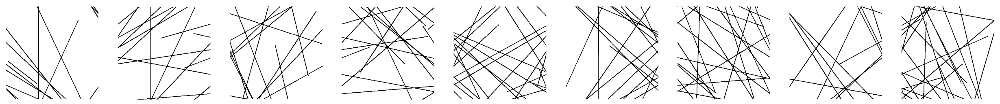
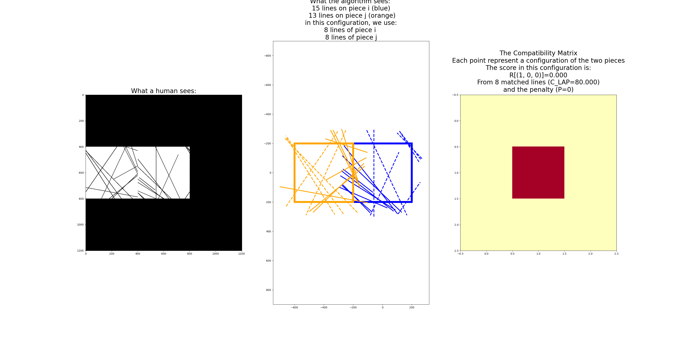
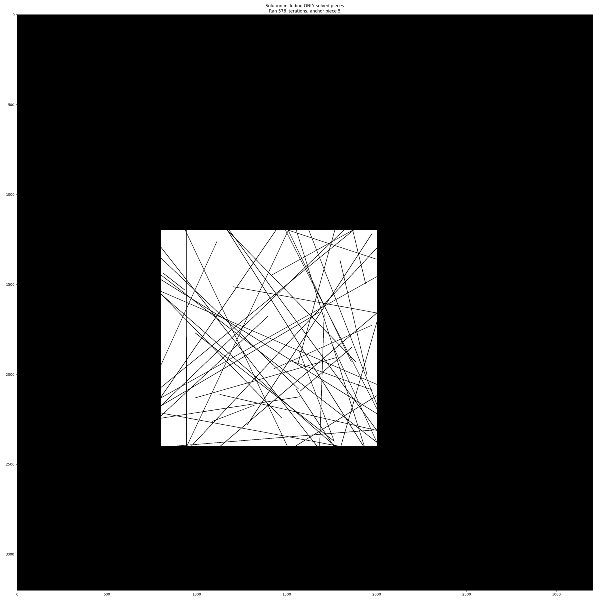

# RL Puzzle Solver 

This repo contains the code used in the 2024 ACCV paper: *Nash meets Wertheimer: Using Good Continuation in Jigsaw Puzzles*.

This repo is under active development (for extensions), we provide here below some explanation to reproduce the paper experiments. 

More code, more puzzles and newer versions are coming soon!

# 1) Description
We assume here that a *puzzle* is prepared (the code for that will be documented and provided).
This means that we have a folder with the pieces (and their binary masks and polygons).
To solve the puzzle, we can breakdown the workflow in small steps:
- Create the ***partial payoff matrix*** (Section 4.1 of the paper) --> [See below](https://github.com/RePAIRProject/RL_puzzle_solver?tab=readme-ov-file#311-create-the-partial-payoff-matrix-section-41-of-the-paper)
- Calculate the ***line-based compatibility scores*** (Section 4.2 of the paper) --> [See below](https://github.com/RePAIRProject/RL_puzzle_solver?tab=readme-ov-file#312-calculate-the-line-based-compatibility-scores-section-42-of-the-paper)
- Run the ***relaxation-labeling-based solver*** (Section 3.3 of the paper) --> [See below](https://github.com/RePAIRProject/RL_puzzle_solver?tab=readme-ov-file#313-run-the-relaxation-labeling-based-solver-section-33-of-the-paper)

# 2) Installation
Depending on the features used, you may need to install different libraries. 
We rely heavily on:
```
numpy
opencv-python
matplotlib
argparse
scipy
```
We use less, but may still be needed:
```
skfmm
scikit-learn
scikit-image
opencv-python-contrib
```

# 3) Usage 
As described above, we have 3 steps to get to the final solution, which can be performed with 3 separate scripts.

# 3.1) Puzzles with Squared Pieces

We provide here an example to show how to use the code, the $3\times3$ squared puzzle shown in Fig. 2 of the paper.
It is very hard for a human, but straightforward when using the algorithm.



## 3.1.1) Create the ***partial payoff matrix*** (Section 4.1 of the paper)
Run the script to create the matrix
```bash
python features/compute_square_regions_masks.py --dataset ACCV_fig2_puzzle --puzzle image_00000 --xy_step 400 --xy_grid_points 3
```

#### Breakdown: 
We compute the matrix on the *dataset* `ACCV_fig2_puzzle` (which is the `output` folder) and in particular, on the *puzzle* `image_00000` (the first and only one in this case). The puzzle is already in the output folder. 

We use as parameters: a grid of $3\times3$ (`--xy_grid_points 3`) as they are squared pieces, a step of $400$ pixels (`--xy_step 400`) as each piece is a squared image of $400 \times 400$ pixels.

#### Output: 
This will create a `regions_matrix` folder inside `ACCV_fig2_puzzle/image_00000/` which contains the matrix (saved as `.mat` or `.npy` file) and a visualization folder to visualize the results.

## 3.1.2) Calculate the ***line-based compatibility scores*** (Section 4.2 of the paper)
Run the script to calculate the compatibility:
```bash
python compatibility/comp_irregular.py --dataset ACCV_fig2_puzzle --puzzle image_00000 --lines_det_method exact --cmp_type lines --cmp_cost LAP
```
#### Breakdown: 
`--dataset`, `--puzzle` are the same as above, `--lines_det_method` is *exact* as we have the coordinates of the lines and we compute the score using *lines* (`--cmp_type lines`) calculating each pairwise score $R_{ij\gamma}$ by solving the associated **LAP** problem (`--cmp_cost LAP`). 

#### Output: 
This will create a `compatibility_matrix` folder (inside `ACCV_fig2_puzzle/image_00000/`) which contains the matrix (saved as `.mat` or `.npy` file) and a visualization folder to visualize the results.




This animation shows the 4 possible configuration when fixing one piece in the center and moving the other one around. You can see the images of the two pieces on the left, the set of lines chosen in the center, and the compatibility score (including cost and penalty for computing it) on the right (it colors the score each time).

## 3.1.3) Run the ***relaxation-labeling-based solver*** (Section 3.3 of the paper)
Run the script to solve the puzzle using the compatibility scores:
```bash
python solver/solver_irregular.py --dataset ACCV_fig2_puzzle --puzzle image_00000 --lines_det_method exact --cmp_type lines --cmp_cost LAP --anchor 5
```
#### Breakdown: 
`--dataset`, `--puzzle`, `--lines_det_method`, `--cmp_type` and `--cmp_cost` are the same as above, the only new parameter is the reference piece, where the algorithm will start from. It is selected passing the number (in this case, `--anchor 5` means use the 5th piece as anchor/reference and start from that).

#### Output: 
It will create a `solution_using..` where you can find the solution matrix and a visualization of the assembled pieces.



This is the solution of the puzzle shown above.

# 3.2) Puzzles with Polyominoes or Irregular Pieces

More info and one example coming soon! Stay tuned!

# 4) Dataset

## 4.1) Synthetic Puzzles
We are preparing the code for generating the images. We provided (in the output folder) the example with the squared pieces and will provide the code for generating puzzles (squared, polyominoes and irregular).

## 4.2) Puzzles from Vector Maps
We uploaded the vector maps we downloaded from [Openstreetmaps](https://www.openstreetmap.org/) using [Cadmapper](https://cadmapper.com/) on Zenodo. 

You can find the related dataset [here](https://zenodo.org/records/14353233).

The code for creating pieces from the maps will be released soon.

# 5) Known Issues

### ***Problem with input and output data folders path?***

Input and output path, respectively `data_path = 'data'` and `output_dir = 'output'` in the config file (`configs/folder_names.py`) are defined without the full path. If you run the scripts via terminal from the root folder, you should be fine. If you run from subfolders or use special settings, you can set these two accordingly.

### ***ModuleNotFoundError: No module named 'configs'***
You should provide python the path where you are. Please run the code from the root folder of `RL_puzzle_solver` (`cd ~/RL_puzzle_solver`) and export the current path to the `PYTHONPATH` environmental variable.
```
export PYTHONPATH=$PWD:$PYTHONPATH
```

### ***Issues when importing `shapely`***

If you get 
```
ImportError: cannot import name 'transform' from 'shapely' (~/miniconda3/lib/python3.9/site-packages/shapely/__init__.py)
``` 
then you probably have an old version of shapely. Updating it (I guess `pip install --update shapely` should be enough) usually solves the problem.

# 6) Relevant publications
If you find our code useful for your research, please cite
```
@inproceedings{nash2024ACCV,
  title={Nash Meets Wertheimer: Using Good Continuation in Jigsaw Puzzles},
  author={Khoroshiltseva, Marina and Palmieri, Luca and Aslan, Sinem and Vascon, Sebastiano and Pelillo, Marcello},
  booktitle={17th Asian Conference on Computer Vision ({ACCV})},
  year={2024}
}
```

# 6) Acknowledgements

This project has received funding from the European Union’s Horizon 2020 research and innovation programme under grant agreement No 964854.

We use part of other open source software/tools:
- [PuzzleSolving-tool](https://github.com/xmlyqing00/PuzzleSolving-tool) from [Yongqing Liang ](https://github.com/xmlyqing00) // We used a modified version included in this repo under `puzzle_utils/puzzle_gen` from [our fork of their framework](https://github.com/RePAIRProject/2DPuzzleSolving-tool)
- We recommend using [DeepLSD](https://github.com/cvg/DeepLSD) from [Computer Vision and Geometry Lab, ETH Zurich](https://github.com/cvg) for detecting lines on real images.

