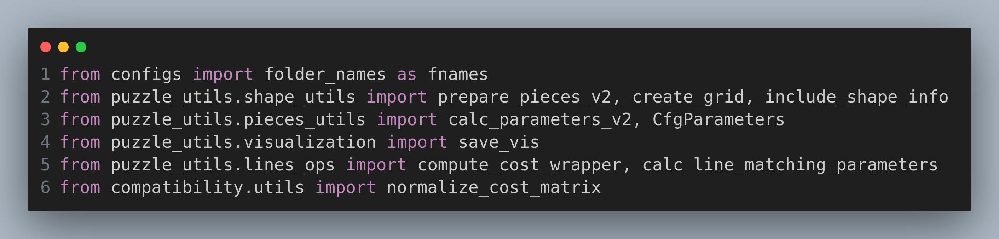

# Code Map

This is intended to give an idea about how the code works.

## Compatibility

The import gives you an idea about where to find stuff:

Pseudo code for the `comp_irregular.py` script (it will do it for each puzzle):

- prepare the pieces (`prepare_pieces_v2` from `puzzle_utils/shape_utils.py`) will create a dictionary with as keys the pieces names and as as value another dict with all you need to solve the puzzle
- get the compatibility parameters from file or calculate (`calc_parameters_v2` from `puzzle_utils/pieces_utils`)
- calculate line matching parameter (`calc_line_matching_parameters` from `puzzle_utils/lines_ops`)
- add shape/polygon info (`include_shape_info` from `puzzle_utils/shape_utils.py`)
- load region matrix (`loadmat` from `scipy`)
- create grid (code is in th file, regular grid)
- call the wrapper! This is the main point. The `compute_cost_wrapper` in `puzzle_utils/lines_ops` is the heart of the compatibility. It receives as input parameters $i,j$ (index of the pieces), `pieces` (the dictionary prepared above), the `region_mask`, the compatibility-related parameters `cmp_parameters`, the general puzzle parameters `ppars` and a verbosity level.
- once the matrix is filled, there is a normalization step (which depends on the method used `LAP` or `LCI`)
DONE!

## Inside the `wrapper`
Inside the `compute_cost_wrapper` [(line 816 of `puzzle_utils/lines_ops.py`)](https://github.com/RePAIRProject/RL_puzzle_solver/blob/develop/puzzle_utils/lines_ops.py#L816) you find everything about compatibility computation.
